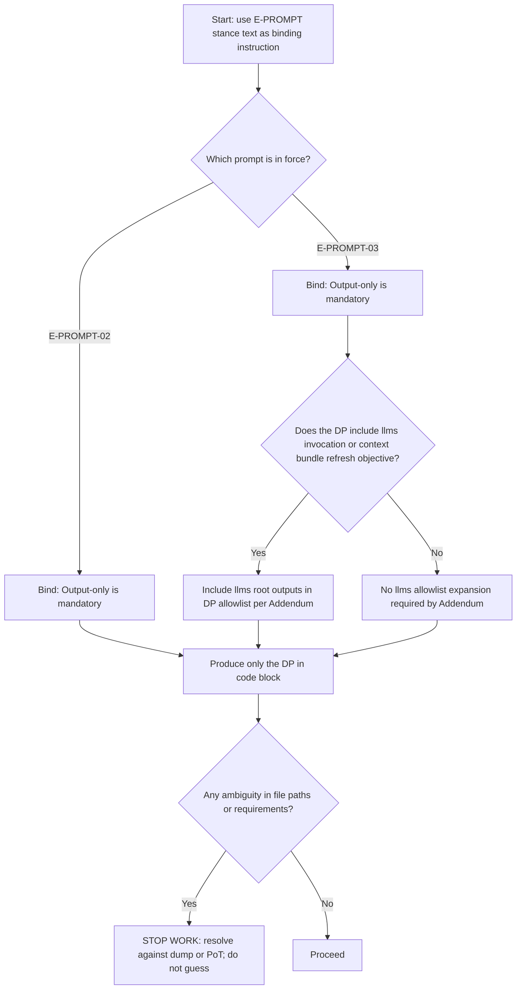

# STELA TASK DASHBOARD (LIVING SURFACE)
Status: ACTIVE
Owner: Integrator
Last Updated: 2026-02-11

## 1. Session State (The Anchor)
Pointer: Session context output (generated by ops/bin/open)
Active Branch: work/dp-ops-0048-task-system-regen (Must match session context output)
Base HEAD: ca9b35f9 (Must match session context output)
Context Manifest: ops/lib/manifests/CONTEXT.md (Checked by tools/lint/context.sh)

## 2. Logic Pointers (The Law)
Primary Constraint: PoT.md (Policy of Truth).

### 2.1 Governance Pointers
Jurisdiction: PoT.md Section 3.
Git Authority: PoT.md Section 4.1.
Behavioral Standard: PoT.md Section 4.2.
Staffing Protocol: PoT.md Section 4.1.

### 2.2 Execution Pointers (The Toolchain)
Linguistic Precision: tools/lint/style.sh.
Structure Verification: tools/verify.sh.
Context Hygiene: tools/lint/context.sh.
Truth Integrity: tools/lint/truth.sh.
DP Validation: tools/lint/dp.sh.
llms Integrity: tools/lint/llms.sh.

## 3. Current Dispatch Packet (DP)
### DP-OPS-00XX: Restore TASK, Include System Regenerative Capabilities, Enforce Worker Exploitation, and Automate Routing Closeout

### 3.1 Freshness Gate (Must Pass Before Work)
Base Branch: main
Required Work Branch: work/dp-ops-00xx-XXXX
Base HEAD: xxxxxxxx

Gate Artifacts (Must Match):
- OPEN: Base HEAD xxxxxxxx
- OPEN-PORCELAIN: Base HEAD xxxxxxxx
- Dump: Base HEAD xxxxxxxx
- Dump Manifest: Base HEAD xxxxxxxx

Preconditions:
- No commits on main.
- Working tree must be clean before execution begins.
- If Base HEAD changes, regenerate gate artifacts and update this gate before proceeding.
- Mandatory artifacts (every execution, no exceptions): OPEN, OPEN-PORCELAIN, dump payload, dump manifest, and DP-OPS-0048-RESULTS.md.

Gate Commands (Must Pass):
- bash tools/lint/context.sh

### 3.2 Required Context Load (Read Before Doing Anything)
Read these in order before making edits:
1. PoT.md
2. TASK.md
3. SoP.md
6. docs/MANUAL.md
7. docs/MAP.md

### 3.3 Scope and Safety
Objective: 

In scope:

Out of scope:

Safety and invariants:

Target Files allowlist (hard gate):

### 3.4 Execution Plan (A-E Canon)

#### 3.4.1 State (What is true now)
Repository anchors:
- Active branch: work/dp-ops-0048-task-system-regen.
- HEAD short hash: ca9b35f9.
- Working tree is dirty with M TASK.md.

Observed drift vectors:
- TASK.md has accumulated sediment (Work Log history) that can act as a few-shot hallucination vector and violate the intended Forever Now statelessness model.
- ops/bin/open uses mktemp without a controlled TMPDIR, creating ephemeral artifacts outside the repo Filing Doctrine control.
- ops/bin/prune uses mktemp without a controlled TMPDIR and does not implement a schema-preserving semantic scrub of TASK.md.
- tools/verify.sh warns on unexpected storage/ clutter and does not allow storage/tmp.

Prompt stance invariants (E-PROMPT-02 vs E-PROMPT-03) and the Addendum and Output-only question:
- E-PROMPT-02 includes Output only and does not include the Addendum.
- E-PROMPT-03 includes both the Addendum and Output only.

Conclusion:
- Output only must remain because both stances require it.
- The Addendum must remain in E-PROMPT-03 because it is the only prompt-layer guarantee for llms allowlisting in the Architect stance.

Comparison table (E-PROMPT-02 vs E-PROMPT-03)
| Provision | E-PROMPT-02 (Hygiene) | E-PROMPT-03 (Architect) | Evidence |
| --- | --- | --- | --- |
| Stance role | Conform an old or broken DP to current TASK schema | Draft a new DP from a plan or summary | E2 L1-L3; E3 L1-L3 |
| Follow PoT and TASK | Required | Required | E2 L6-L8; E3 L6-L8 |
| Do not invent file paths | Required | Required | E2 L14; E3 L13-L14 |
| Addendum about llms allowlisting | Not present | Present | E3 L15 (absent in E2) |
| Output-only requirement | Present | Present | E2 L15; E3 L16 |

Decision flow (PoT-governed literalism) for Addendum and Output-only inclusion

Missing or unspecified files (do not invent):
- plan.md required by the E-PROMPT-03 attach list is not present.

#### 3.4.2 Request (What we are changing)
1. Refactor TASK.md:
   - Restore inclusive and stable schema (Anchor, Law, Contract, Verification, Stream).
   - Ensure Session State includes required fields (Pointer, Active Branch, Base HEAD, Context Manifest).
   - Preserve DP substructure: 3.1 Freshness Gate; 3.2 Required Context Load; 3.3 Scope and Safety; 3.4 A-E Canon.
2. Hardening (Worker Exploitation):
   - Convert Closeout Mandatory Closing Block into instruction-only scaffolding.
   - Remove all pre-filled commit header, PR title, PR description, squash stub, manifest, and review starter content from TASK.md.
   - Enforce Varied Wording provision presence as a cognitive trap.
   - Any default Pass or Checked language in verification outputs is prohibited; proofs must be generated, not implied.
3. Automation (Routing Closeout):
   - Upgrade ops/bin/prune to add a scrub mode that performs the semantic scrub of TASK.md and cleans storage/tmp.
   - Scrub must sanitize the DP header identity, neutralize session state values, preserve closeout scaffolding, and truncate Work Log to a baseline placeholder.
4. Legislation (PoT.md):
   - Add Metabolic Law to Section 1.2 (Axioms).
   - Add Generation Mandate to Section 4.2 (Behavioral Logic Standard).
5. Infrastructure:
   - Introduce storage/tmp (repo-controlled temp dir) and track only storage/tmp/.gitignore.
   - Redirect mktemp usage in ops/bin/open, ops/bin/prune, ops/bin/context, and ops/bin/map to storage/tmp.
6. Closeout refresh objective (Addendum trigger):
   - This DP will invoke ops/bin/llms and ops/bin/map during closeout to refresh discovery bundles and docs/MAP.md.
   - Allowlist must include llms root outputs and docs/MAP.md.

#### 3.4.3 Changelog (Planned edits)
- TASK.md:
  - Restore schema structure and remove pre-filled closeout outputs.
  - Ensure Work Log can be deterministically scrubbed back to a baseline placeholder.
- PoT.md:
  - Add Metabolic Law (Section 1.2 Axioms).
  - Add Generation Mandate (Section 4.2 Behavioral Logic Standard).
- storage/tmp/.gitignore (new):
  - Track only the ignore file so the directory exists while runtime artifacts remain ignored.
- tools/verify.sh:
  - Add storage/tmp to allowed storage items and require it to exist.
- ops/bin/open:
  - Redirect mktemp usage to storage/tmp.
- ops/bin/prune:
  - Redirect mktemp usage to storage/tmp.
  - Add --scrub flag to perform semantic scrub of TASK.md and cleanup of storage/tmp.
  - Preserve existing SoP archiving and DP-target pruning behavior.
- ops/bin/context:
  - Redirect mktemp usage to storage/tmp.
- ops/bin/map:
  - Redirect mktemp usage to storage/tmp.
- docs/MANUAL.md:
  - Update Closeout Cycle to include ops/bin/map and prune --scrub.
- docs/MAP.md:
  - Refresh via ops/bin/map during closeout.
- llms.txt and bundle outputs:
  - Refresh via ops/bin/llms during closeout.

#### 3.4.4 Patch / Diff (Implementation details)
1. Branch setup and hygiene
   - Confirm dirty state and clean it before execution begins if changes are not intended for this DP.
   - Ensure the work branch is work/dp-ops-0048-task-system-regen.
2. Infrastructure: create repo-controlled temp directory
   - Create storage/tmp and track only storage/tmp/.gitignore.
3. tools/verify.sh: allow storage/tmp
   - Update the storage allowed list and require storage/tmp to exist.
4. ops/bin/open: redirect mktemp to storage/tmp
   - Ensure storage/tmp exists before mktemp is called.
5. ops/bin/context and ops/bin/map: redirect mktemp to storage/tmp
   - Ensure storage/tmp exists before mktemp is called.
6. ops/bin/prune: implement Routing Closeout scrub and storage/tmp cleanup
   - Add argument parsing for --scrub alongside existing --dp support.
   - Ensure internal mktemp uses storage/tmp.
   - Implement cleanup of storage/tmp (delete all files other than storage/tmp/.gitignore).
   - Implement scrub_task semantic scrub using awk against the actual TASK.md text.
7. TASK.md restoration (schema and exploitation hardening)
   - Reset TASK.md content so the committed baseline contains the full structure and instruction-only closeout scaffolding.
   - Ensure stable markers used by scrub_task remain present.
8. PoT.md amendments
   - Add Metabolic Law to Section 1.2 (Axioms).
   - Add Generation Mandate to Section 4.2 (Behavioral Logic Standard).
9. docs/MANUAL.md updates
   - Update Closeout Cycle to include ops/bin/map and prune --scrub.
10. Map and llms refresh (Closeout objective)
   - Run ops/bin/map and ops/bin/llms during closeout after allowlist compliance is confirmed.

#### 3.4.5 Receipt (Proofs to collect)
Create storage/handoff/DP-OPS-0048-RESULTS.md with receipts that prove the system regen and exploitation properties.

Receipt requirements:
- Base State: session summary (branch, head, dirty state) plus state capture identifiers (HEAD, file count).
- Verification receipts (copy and paste outputs):
  - ./tools/verify.sh
  - ./tools/lint/truth.sh
  - ./tools/lint/style.sh
  - ./tools/lint/dp.sh TASK.md
  - ./tools/lint/llms.sh
- Functional receipts:
  - Demonstrate ops/bin/open uses storage/tmp by listing storage/tmp before and after and confirming no leaks into /tmp.
  - Demonstrate ops/bin/prune --scrub:
    - TASK.md is scrubbed back to template identity.
    - Work Log is reduced to (No active thread).
    - Closeout remains instruction-only with no filled outputs.
    - storage/tmp is empty except storage/tmp/.gitignore.
- Routing receipts:
  - Confirm docs/MAP.md updated via ops/bin/map where applicable.
  - Confirm llms bundles refreshed and tools/lint/llms.sh passes.

## 4. Closeout (Mandatory)
- Execute docs/MANUAL.md Closeout Cycle in order (Verify, Harvest, Refresh, Log, Prune).
- Update SoP.md with a DP-OPS-0048 entry at completion, including objective summary and verification commands run.
- Run Routing Closeout scrub at the end of the closeout sequence: ./ops/bin/prune --dp=DP-OPS-0048 --scrub.
- Ensure the next session begins with refreshed session context output and matching state capture artifacts.

Mandatory Closing Block
Varied Wording provision: Each entry must use meaningfully distinct wording; copy or minor tense changes are not acceptable. Entry 4 must differ from Entry 1.

Primary Commit Header (plaintext)
(Generate at closeout; do not pre-fill in TASK.md)

Pull Request Title (plaintext)
(Generate at closeout; do not pre-fill in TASK.md)

Pull Request Description (markdown)
(Generate at closeout; do not pre-fill in TASK.md)

Final Squash Stub (plaintext) (Must differ from #1)
(Generate at closeout; do not pre-fill in TASK.md)

Extended Technical Manifest (plaintext)
(Generate at closeout; do not pre-fill in TASK.md)

Review Conversation Starter (markdown)
(Generate at closeout; do not pre-fill in TASK.md)

## 4.1 Thread Transition (Reset / Archive Rule)
- Append a THREAD END entry to the TASK.md Work Log at completion.
- Execute Routing Closeout scrub only after all receipts and SoP logging are complete.

## 5. Work Log (Timestamped Continuity)
2026-02-11 00:00 - THREAD START: DP-OPS-0048. Seed: Restore TASK with system regen, enforce worker exploitation, automate Routing Closeout via ops/bin/prune scrub and storage/tmp. Base HEAD: ca9b35f9. Verification: NOT RUN. Blockers: working tree dirty (M TASK.md). NEXT: Clean working tree, execute 3.4, capture RESULTS.
